# Haven Professional Portal — Counselor and Authority Design

**Status:** Agreed product-design baseline  
**Audience:** Product designers, engineers, mental-health reviewers, National Helpline Against Atrocities programme owners, district and State administrators, police/protection representatives, legal-services representatives, and evaluators  
**Scope:** Counselor workbench, authority operations, district/State/national dashboards, role-based access, alerts, intervention recommendations, follow-through and oversight  
**Not covered:** Victim-interface details, analytical-model implementation, production identity verification, or final government integration contracts

## 1. Purpose in one page

The professional side of Haven has two goals:

1. **Response:** Alert the correct counselor or official, recommend an appropriate intervention, assign responsibility, and verify that somebody acted.
2. **Oversight:** Provide district, State and national dashboards for monitoring vulnerable victims, urgent cases, response delays, intervention delivery and service gaps.

It is one coordinated platform with two visibly separate workspaces:

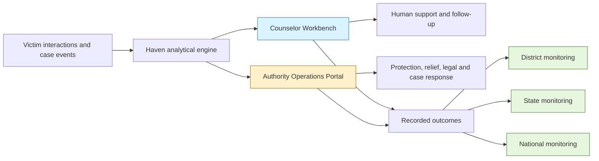

The counselor understands the victim's mental-health and safety context. Authorities receive the operational facts needed to provide protection, relief, legal help, rehabilitation or case action. Senior officials receive oversight appropriate to their level. Nobody receives unrestricted access merely because they hold a senior title.

## 2. Abbreviations and terms

This document uses the following terms:

| Term | Full meaning | Meaning in Haven |
|---|---|---|
| **NHAA** | National Helpline Against Atrocities | The government grievance and assistance context from which the victim's authorized case record may be loaded |
| **ERSS** | Emergency Response Support System | India's 112-based emergency-response system for police, health, fire and rescue coordination |
| **DLSA** | District Legal Services Authority | District-level legal-services body that may receive an authorized legal-aid referral |
| **SLSA** | State Legal Services Authority | State-level legal-services body that may coordinate or receive escalated legal-aid matters |
| **NALSA** | National Legal Services Authority | National legal-services institution that supports legal-aid policy and coordination |
| **PoA Act** | Scheduled Castes and the Scheduled Tribes (Prevention of Atrocities) Act, 1989 | The principal legal context for atrocity offences and the rights and protection of victims and witnesses |
| **PoA Rules** | Scheduled Castes and the Scheduled Tribes (Prevention of Atrocities) Rules, 1995, as amended | Rules describing responsibilities connected with investigation, relief, rehabilitation, monitoring and implementation |
| **RBAC** | Role-Based Access Control | Access based on a verified job function, such as counselor or district relief officer |
| **ABAC** | Attribute-Based Access Control | Additional access checks based on jurisdiction, case assignment, emergency status, purpose and data sensitivity |
| **Pseudonymous** | Identified by a substitute identifier rather than a public real name | Used in analytics or audit views where identity is unnecessary but records must remain linkable under authorization |
| **Acknowledgement** | Confirmation that a responsible human or system has received and accepted a task | It is not proof that assistance was delivered |
| **Intervention** | A human-reviewed support or government action | Examples include counseling, medical referral, protection, relief, legal aid, relocation review or rehabilitation |
| **Break-glass access** | Exceptional, time-limited access during an urgent or formally approved situation | Requires a reason, strong authentication, automatic logging and later review |

## 3. Professional platform structure

```mermaid
flowchart TB
    P[Haven Professional Platform]

    P --> CW[Counselor Workbench]
    P --> AO[Authority Operations]
    P --> MO[Monitoring and Oversight]
    P --> GA[Governance and Administration]

    CW --> CQ[Priority Queue]
    CW --> VC[Victim Support Workspace]
    CW --> LC[Live Crisis Workspace]
    CW --> CF[Appointments and Follow-up]
    CW --> CS[Clinical Supervision]

    AO --> AC[Live Alert Centre]
    AO --> IQ[Intervention Queue]
    AO --> AK[Assigned Cases]
    AO --> ES[Escalations]
    AO --> SR[Service Registry and Capacity]

    MO --> DD[District Dashboard]
    MO --> SD[State Dashboard]
    MO --> ND[National Dashboard]
    MO --> PR[Reports and Service Gaps]

    GA --> UM[Users, Roles and Jurisdictions]
    GA --> AU[Access and Action Audit]
    GA --> IH[Integration Health]
    GA --> PV[Approved Policy Versions]
```

The navigation is shared, but each person sees only the sections and cases permitted for their role.

## 4. Classification used by the interfaces

Haven maintains separate classifications for counselor work and authority work. They may exist at the same time.

### Counselor priority

| Code | Full label | Meaning |
|---|---|---|
| **C0** | Counselor Immediate Response | Definite current danger requiring live human response now |
| **C1** | Counselor Urgent Unresolved Review | Serious concern exists, but important safety facts remain unclear |
| **C2** | Counselor Priority Support | Substantial, persistent or worsening distress without confirmed immediate danger |
| **C3** | Counselor Planned Follow-up | Continuing but non-urgent support need |
| **Monitor** | Monitor or Offer Check-in | Evidence is indirect or insufficient; current safety may still be unassessed |

“Not assessed” never means “low risk.”

### Authority task priority

| Code | Full label | Meaning |
|---|---|---|
| **A0** | Authority Emergency Life Safety | Real-time emergency coordination involving ERSS, a counselor or another approved responder |
| **A1** | Authority Immediate Protection | Active violence, intimidation, coercion, retaliation or an unsafe location requiring urgent protection |
| **A2** | Authority Urgent Relief or Rehabilitation | Urgent shelter, transport, subsistence, medical support, relocation support or rehabilitation need |
| **A3** | Authority Time-Bound Case Action | Investigation, proceeding, compensation, relief or other case responsibility is overdue or time-sensitive |
| **A4** | Authority Legal-Support Referral | Legal aid, proceeding preparation or access-to-justice support is required |
| **A5** | Authority Programme Review | A recurring or systemic problem requires administrative review rather than an individual emergency response |

These are workflow labels, not permanent descriptions of a person. A victim can have **C2 Counselor Priority Support** and **A1 Authority Immediate Protection** simultaneously.

## 5. Counselor Workbench

### 5.1 Counselor roles

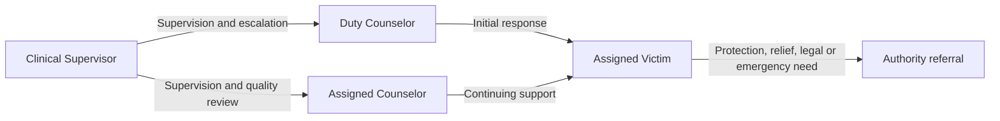

#### Duty counselor

The duty counselor handles new urgent alerts and unassigned cases. They can:

- Receive C0 Counselor Immediate Response and C1 Counselor Urgent Unresolved Review alerts.
- Review exact statements and unresolved safety questions supporting the alert.
- Contact the victim through an approved channel.
- Conduct immediate safety clarification.
- Initiate or confirm emergency escalation.
- Record the initial human assessment.
- Assign the victim to a continuing counselor.

#### Assigned counselor

The assigned counselor supports a defined caseload over time. They can:

- Review relevant Haven conversations.
- Review questionnaires, trends and important speech context.
- See case events relevant to the victim's wellbeing.
- Conduct counseling sessions.
- Create a human-reviewed support plan.
- Recommend medical assessment or other interventions.
- Refer non-clinical needs to the correct authority.
- Schedule and document follow-up.
- Correct an inaccurate engine interpretation.

The engine may recommend a medical or psychiatric assessment. It does not prescribe medication or decide a medical-treatment plan.

#### Clinical supervisor

The clinical supervisor oversees difficult or escalated cases. They can:

- Review assigned escalations.
- Reassign counselor workload.
- Review safety assessments and closure decisions.
- Approve counselor-facing protocols.
- Review harmful or incorrect Haven responses.
- Conduct quality review when a documented professional purpose exists.

A supervisor does not automatically browse every victim conversation.

### 5.2 Counselor home dashboard

The counselor home screen presents work requiring attention:

- Active live crises.
- New urgent cases.
- Victims awaiting first contact.
- Scheduled sessions.
- Missed or unsuccessful contacts.
- Follow-ups due today.
- Support plans requiring review.
- Referrals awaiting action.
- Victims whose current safety remains unassessed.
- External alerts sent but not acknowledged.
- Counselor workload and queue age.

### 5.3 Victim Support Workspace

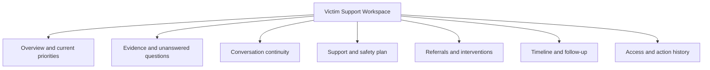

The workspace contains:

- Preferred name, language and safe-contact method.
- Current counselor priority and its explanation.
- Current safety facts and unresolved questions.
- Exact supporting statements with timestamps.
- Original text, translated text and translation confidence.
- Transcripts and relevant audio excerpts when professionally necessary.
- Questionnaire item responses and deterministic scores.
- Longitudinal changes and relevant case events.
- Guidance already given by Haven.
- Previous counselor contacts and interventions.
- Journal entries the victim chose to share, plus narrowly disclosed emergency evidence when approved policy requires it.

The counselor does not receive hidden model reasoning, fabricated diagnoses or an unexplained “suicide probability.”

### 5.4 Counselor actions

A counselor may:

- Acknowledge and accept a case.
- Contact the victim.
- Record unsuccessful contact.
- Request specific clarification through Haven.
- Update the counselor priority with a reason.
- Create or revise a support plan.
- Recommend a referral.
- Activate an approved emergency pathway.
- Handoff to another counselor.
- Schedule follow-up.
- Correct disputed evidence.
- Resolve counselor work with a recorded outcome.

## 6. Authority roles and responsibilities

Exact job titles may vary across States and Union Territories. Haven therefore uses logical roles that are later mapped to officially approved local offices.

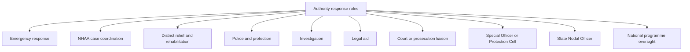

### 6.1 Emergency responder

An ERSS or other approved emergency responder handles immediate danger. They receive only:

- Identity and contact information required to respond.
- Available current location.
- Exact present-danger facts and time.
- Whether the victim is responsive.
- Communication language and accessibility needs.
- Actions already underway.
- A coordination callback route.

They do not receive routine access to the victim's counseling history, journal or unrelated atrocity details.

### 6.2 NHAA case officer or district coordinator

This role coordinates the grievance and connected assistance. It can access:

- The authorized NHAA source record.
- Current case stage and responsible offices.
- Case-linked deadlines and delays.
- Protection, relief, legal and rehabilitation tasks.
- Previous official actions and escalation history.
- The minimum support summary necessary to coordinate action.

It does not automatically receive private therapeutic content.

### 6.3 District relief and rehabilitation officer

This role coordinates:

- Immediate relief.
- Medical-support access.
- Shelter, food, clothing, transport or subsistence assistance.
- Compensation follow-up.
- Socio-economic rehabilitation.
- Relocation-support review.

It sees only facts required to assess, arrange and record the relevant assistance.

### 6.4 District police or protection role

This role responds to:

- Current violence or threats.
- Intimidation and coercion.
- Retaliation.
- Unsafe locations.
- Victim or witness-protection needs.
- Failure of existing protection measures.

It may see current threat facts, relevant persons, location and necessary contact information. It does not receive unrelated emotional disclosures or counseling records.

### 6.5 Investigating officer

The investigating officer receives lawfully scoped investigation tasks, deadlines and relevant intimidation information. Haven must never present distress, voice characteristics or counseling history as evidence that an allegation is true, false or unreliable.

### 6.6 Legal-aid role

An authorized DLSA, SLSA, NALSA or partner role handles:

- Legal-aid referrals.
- Access to representation.
- Explanation of victim rights.
- Preparation for proceedings.
- Referral status and follow-through.

Only the legal need, relevant case facts and contact preferences are disclosed.

### 6.7 Court or prosecution liaison

This role coordinates:

- Notice of upcoming proceedings.
- Preparation and practical support for attendance.
- Travel or maintenance assistance where applicable.
- Protection-order or court-support coordination.

It does not receive unrestricted counseling information.

### 6.8 Special Officer or Protection Cell

This role handles repeated threats, coordinated protection failures, recurrence concerns and multi-agency prevention or support work.

### 6.9 State Nodal Officer

The State Nodal Officer coordinates district administration and police implementation. The role sees State-level monitoring, overdue district work, service gaps and individually escalated cases. It does not automatically receive every victim's private record.

### 6.10 National NHAA programme role

The national role monitors programme performance, State implementation, unmet demand and systemic failures. It normally receives aggregate information. Identifiable records require a formal escalation, statutory purpose or specially authorized review.

## 7. Authority Operations Portal

### 7.1 Main navigation

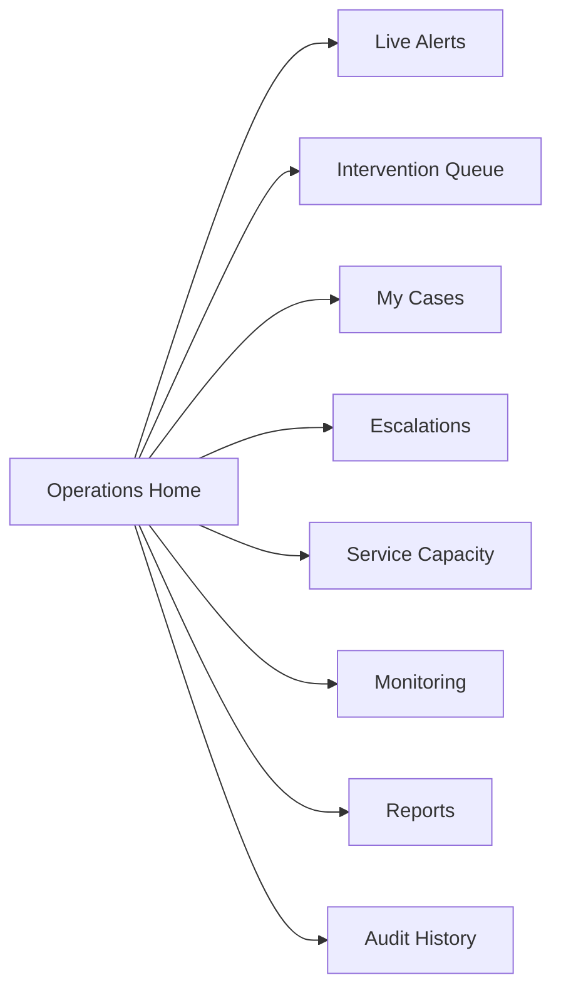

The visible destinations depend on the user's role. For example, a district relief officer may see relief tasks and district capacity, while a national programme user sees national monitoring and formal escalations.

### 7.2 Authority task page

Every task page shows:

- Full task label and urgency.
- NHAA docket and responsible office.
- Why the task exists.
- Supporting source facts and timestamps.
- Recommended intervention.
- Evidence limitations and unresolved questions.
- Intended official or service.
- Required acknowledgement and action deadline.
- Previous attempts, assignments and escalations.
- Victim communication preferences.
- Authorized links to source evidence.

An authority user may, according to permission:

- Acknowledge the task.
- Accept responsibility.
- Assign it to an authorized person.
- Request missing information.
- Approve or decline a non-emergency recommendation.
- Record the reason for declining.
- Refer the victim to an approved service.
- Contact the victim where permitted.
- Mark action in progress.
- Record service unavailability.
- Escalate the matter.
- Record assistance as delivered.
- Request victim or counselor confirmation.
- Close the task with a documented outcome.

## 8. Live Alert Centre

### 8.1 Immediate-danger flow

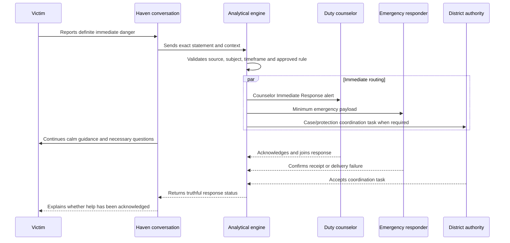

A model may identify the definite statement, but it does not freely choose recipients or directly operate communication tools. A fixed, professionally approved rule verifies the evidence and the platform performs the routing.

### 8.2 Alert states

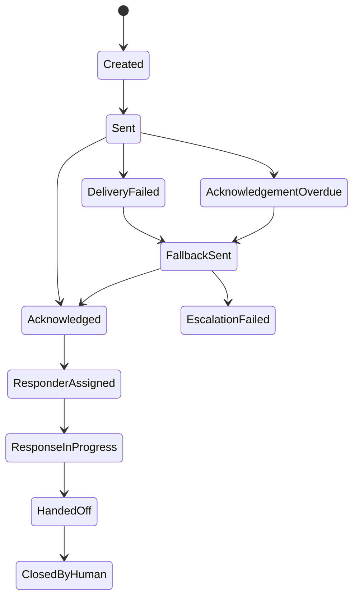

“Sent” means the platform attempted delivery. “Acknowledged” means a responsible recipient accepted the task. Neither means that the victim has received help. The alert remains open until an authorized human records a handoff and closure outcome.

## 9. Intervention recommendations

### 9.1 Intervention families

The analytical engine may recommend that an authorized human consider:

- Counseling.
- Urgent mental-health assessment.
- Medical assessment or treatment referral.
- Emergency response.
- Police or witness-protection review.
- Relocation-support review.
- Shelter, transport or subsistence support.
- Financial relief or compensation follow-up.
- Legal aid.
- Rehabilitation services.
- Investigation or proceeding follow-up.

Each recommendation includes:

- The intervention being proposed.
- The reason for it.
- Supporting facts.
- Urgency.
- Intended human owner.
- Unresolved questions.
- Known service availability.
- Required follow-up.

### 9.2 Intervention lifecycle

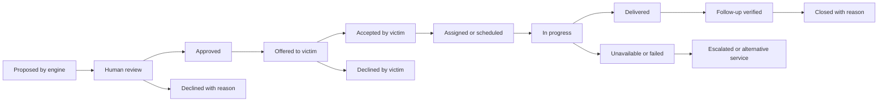

The platform keeps each state distinct. A recommendation is not an approval; an approval is not delivery; and delivery is not a successful outcome until appropriate follow-up is recorded.

### 9.3 Primary ownership

| Intervention | Primary human owner |
|---|---|
| Counseling | Counselor service |
| Medical or psychiatric assessment | Counselor and authorized health service |
| Immediate emergency response | ERSS or another officially approved emergency service |
| Police or witness protection | Police/protection authority |
| Relocation review | District/protection authority |
| Shelter, transport and subsistence | District relief authority |
| Financial relief or compensation | District relief or NHAA case authority |
| Legal aid | DLSA, SLSA, NALSA or authorized legal-services partner |
| Rehabilitation | District rehabilitation or service coordinator |
| Investigation delay | Investigating or case-supervision role |
| Proceeding support | Court or prosecution liaison |

## 10. Access model

### 10.1 Access decision

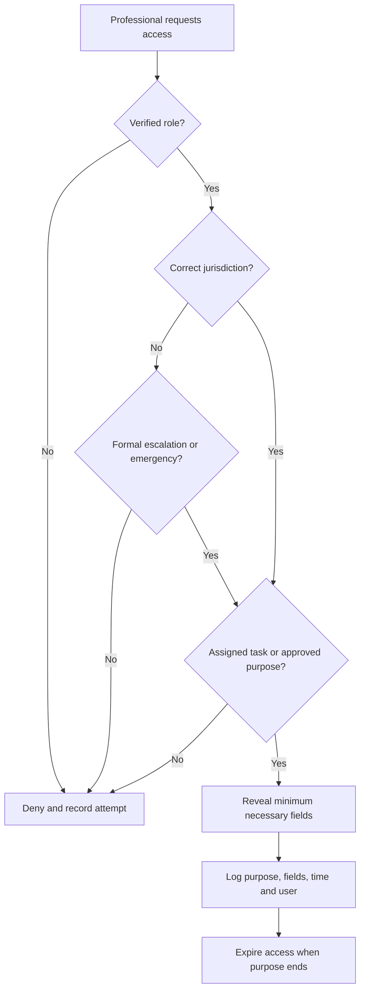

Haven combines RBAC—Role-Based Access Control—with ABAC—Attribute-Based Access Control. A verified role establishes what work a person can perform. Jurisdiction, assignment, emergency state and purpose determine which particular records and fields they may access.

### 10.2 Information levels

| Level | Information | Typical recipients |
|---|---|---|
| **Level 0 — Aggregate** | Counts, rates, trends and capacity without victim identity | State and national monitoring roles |
| **Level 1 — Operational case** | Docket, stage, deadlines, responsible office and intervention status | Assigned NHAA and district roles |
| **Level 2 — Sensitive support summary** | Current safety or functional need and counselor-approved summary | Assigned counselor and task-specific authority role |
| **Level 3 — Restricted source material** | Exact conversation excerpts, questionnaires, shared journal entries and relevant audio | Assigned counselor; exceptional approved authority access |
| **Level 4 — Emergency payload** | Minimum identity, location, danger facts, language and contact needed to respond | Emergency responder and necessary crisis participants |

Level 4 is urgent but narrow. It is not permission to explore Level 3 material.

### 10.3 Access matrix

Legend:

- **Full:** Available within assigned professional duties.
- **Scoped:** Only the fields needed for the assigned task.
- **Escalated:** Available only after formal escalation or special approval.
- **Aggregate:** Identity is normally hidden.
- **None:** Not available through the role.

| Role | Identity and contact | Authorized case record | Counselor summary | Exact conversation or audio | Journal | Authority tasks | Analytics |
|---|---|---|---|---|---|---|---|
| Duty counselor | Scoped | Relevant summary | Full for active response | Scoped | Shared or emergency evidence only | Status only | Counselor queue |
| Assigned counselor | Full for caseload | Relevant summary | Full | Full within support purpose | Entries shared by victim | Recommend and track | Own caseload |
| Clinical supervisor | Scoped to supervision | Relevant summary | Full for supervised cases | Supervised or escalated | Shared or emergency evidence only | Status and escalation | Clinical programme |
| Emergency responder | Emergency only | Minimum necessary | Immediate-safety summary | Exact danger excerpt only | None | Emergency task | Emergency operations |
| NHAA case officer | Full for assignment | Full authorized record | Actionable summary | None by default | None | Full assigned tasks | District operations |
| District relief officer | Scoped | Relief-relevant facts | Functional-need summary | None | None | Relief tasks | Relief workload |
| Police/protection role | Scoped | Threat-relevant facts | Immediate-safety summary | Exact threat excerpt if needed | None | Protection tasks | Protection workload |
| Investigating officer | Scoped | Investigation scope | None by default | Separately authorized only | None | Investigation tasks | Case-process measures |
| Legal-aid role | Scoped | Legal-relevant facts | None by default | None | None | Legal referrals | Legal-service measures |
| State Nodal Officer | Escalated | Escalated cases | Minimum summary | None by default | None | State escalations | State aggregates |
| National programme role | Exceptional escalation | Exceptional escalation | None by default | None | None | National escalations | National aggregates |
| Technical administrator | None by default | None by default | None | None | None | Technical metadata | System health |
| Independent auditor | Pseudonymous by default | Audit-scoped | Audit-scoped | Special approval | None by default | Audit history | Governance measures |

## 11. District dashboard

The district dashboard is the primary operational monitoring level.

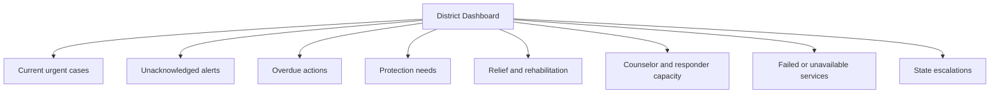

It should show:

- Active A0 Authority Emergency Life Safety and A1 Authority Immediate Protection tasks.
- Vulnerable victims with unresolved assigned actions.
- Counselor cases requiring district assistance.
- Urgent relief, rehabilitation and relocation needs.
- Overdue compensation or case responsibilities.
- Alerts awaiting acknowledgement.
- Upcoming deadlines.
- Failed contacts and referrals.
- Services currently unavailable.
- Cases escalated to the State.
- Counselor and responder workload.

Authorized district coordinators may see identifiable cases in their jurisdiction when they hold an operational or supervisory responsibility.

District measures include time to acknowledgement, first contact, responder assignment and assistance delivery; overdue-action rate; failed-contact rate; intervention acceptance and delivery; unresolved protection work; and service-capacity shortages.

## 12. State dashboard

The State dashboard coordinates districts and handles escalations.

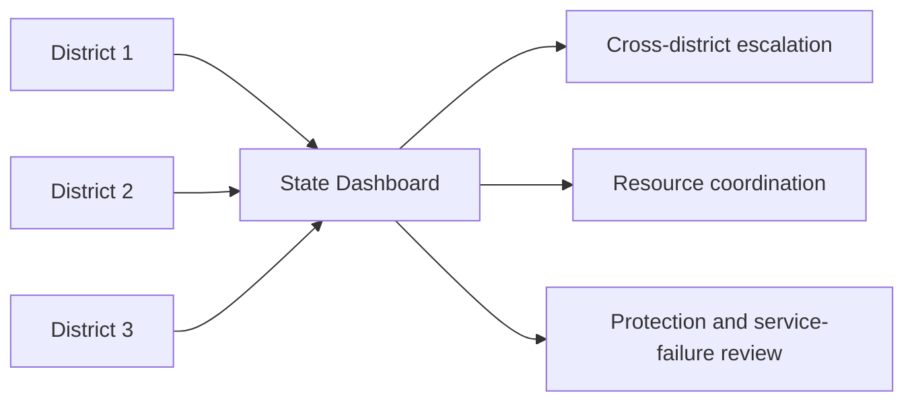

It should show:

- Vulnerable and high-priority case counts by district.
- Active emergency and protection work.
- Districts with overdue acknowledgement or action.
- Relief, rehabilitation and compensation delays.
- Counselor and service capacity by district.
- Repeated protection failures.
- Formally escalated individual cases.
- Differences in response by language or channel.
- Data-quality and integration failures.

State users normally see aggregate district information. Victim identity becomes visible only for an assigned escalation, approved statutory review, quality investigation or emergency coordination.

## 13. National dashboard

The national dashboard supports programme monitoring, resource planning and evidence-based policy.

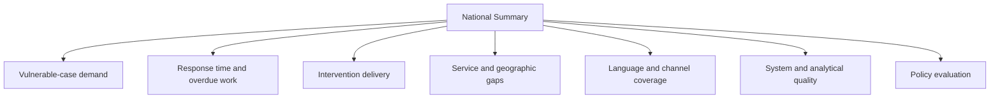

It should show:

- Total enrolled and actively monitored victims.
- Active counselor and authority classifications by category.
- Emergency, protection, relief, legal and rehabilitation demand.
- State and district response times.
- Overdue and failed actions.
- Counselor and service capacity.
- Intervention acceptance and delivery rates.
- Compensation and rehabilitation delays.
- Language and communication-channel coverage.
- Recurring procedural stressors.
- Geographic service gaps.
- Alert-delivery and integration failures.
- Translation, transcription and analytical quality by language and channel.
- Governance and audit indicators.

The national dashboard does not provide routine access to a searchable national directory of victims. Individual details require a formal, authorized operational purpose.

## 14. Monitoring rules

Dashboards must use understandable workflow categories rather than unexplained model scores.

Do show:

- Immediate life-safety emergencies.
- Immediate protection requirements.
- Urgent relief or rehabilitation needs.
- Priority counselor-support demand.
- Overdue case actions.
- Legal-support requirements.
- Multiple unresolved needs.
- Safety not yet assessed.
- Whether assistance was actually delivered.

Do not show:

- “Most mentally unstable victims” lists.
- Victim credibility or truthfulness scores.
- Emotion maps based on voice tone.
- A precise personal suicide probability.
- Publicly visible victim-location maps.
- Raw counseling or journal content in aggregate dashboards.
- District rankings without workload, coverage and denominator context.
- “Successful intervention” merely because an alert or recommendation was generated.
- One combined number that mixes emotional distress, threats, legal delay and financial need.

## 15. Audit and exceptional access

Every important professional action is recorded:

- Who viewed sensitive information.
- Which fields were viewed.
- Why access was permitted.
- Who acknowledged or assigned a task.
- Which evidence supported a recommendation.
- Who approved or declined it.
- What was offered to the victim.
- Whether the victim accepted it.
- Whether the service was delivered.
- Who closed the task and why.
- Which policy and analytical-component versions were active.

Technical administrators manage users, roles, jurisdiction mappings, service directories, integrations and policy deployment. They do not automatically receive victim-content access.

Break-glass access requires:

- A stated emergency or approved exceptional purpose.
- Strong authentication.
- The minimum necessary fields.
- Automatic expiration.
- Immediate audit logging.
- Notification to the designated security or privacy owner.
- Mandatory later review.

## 16. What remains dependent on official confirmation

This document finalizes the product structure, but production deployment still requires official decisions about:

- The real office and person mapped to each logical role in every State and Union Territory.
- Official identity verification and login federation.
- Acknowledgement and response deadlines.
- State-specific escalation ladders.
- Which roles may directly contact a victim.
- Which roles may close each task type.
- Access to location, audio and exact conversation evidence.
- Approved ERSS, police, NHAA and legal-services connectors.
- Whether emergency or official notification application programming interfaces exist.
- Retention, deletion and lawful-disclosure requirements.
- Staffing hours and fallback routes.

The prototype must not claim that 112, a police unit or an official has been contacted unless an approved production connector or authorized human confirms it.

## 17. Relationship to the other Haven documents

This document is self-contained, but it fits alongside three existing plans:

- **`NHAA_DYNAMIC_DISTRESS_ENGINE_DESIGN.md` — NHAA Dynamic Mental Health Monitoring and Distress Prediction Engine:** The detailed technical design for the evidence-orchestration harness. It explains how case records, conversations, questionnaires, speech information, longitudinal change and policy rules produce counselor priorities, authority tasks and audited alerts. It does not define the complete professional user interface.
- **`NHAA_ENGINE_FEATURE_GUIDE.md` — NHAA Engine Feature Guide:** A shorter, reader-friendly explanation of what the analytical engine does, why its features exist and what victims, counselors, authorities and policymakers receive.
- **`NHAA_VICTIM_EXPERIENCE_DESIGN.md` — NHAA Victim Experience:** The victim-facing product design covering the Haven chat and speech interface, fixed three-dimensional companion, journal, counseling booking, case view, resources and voluntary peer or mentor support.

The present document turns the counselor and authority outputs from those plans into a complete professional portal structure.

## 18. Reference basis

### Scheduled Castes and the Scheduled Tribes (Prevention of Atrocities) Act, 1989

[Official text on India Code](https://www.indiacode.nic.in/bitstream/handle/123456789/1920/1/a1989-33.pdf)

Section 15A describes rights of victims and witnesses. It places responsibility on the State to protect victims, dependants and witnesses from intimidation, coercion, inducement, violence and threats. It also addresses notice of proceedings, protection, travel and maintenance expenses, socio-economic rehabilitation, relocation and court review. These responsibilities inform the protection, relief, court-support and escalation areas of the portal.

### Scheduled Castes and the Scheduled Tribes (Prevention of Atrocities) Rules, 1995, as amended

[Rules and amendments hosted by NHAA](https://nhapoa.gov.in/schemes/SC-ST%20POA%20Rules%202016-2018.pdf)

The Rules provide operational context for district administration, investigation, relief, rehabilitation, State coordination and monitoring. Exact role mapping still requires confirmation for each jurisdiction.

### NHAA Handbook on Prevention of Atrocities

[Handbook hosted by the National Helpline Against Atrocities](https://nhapoa.gov.in/schemes/Handbook.pdf)

The handbook describes the wider institutional environment, including police, District Magistrates, legal-services authorities, Special Officers, Protection Cells, prosecutors and monitoring arrangements. It supports representing these as separate logical roles rather than one unrestricted “authority” account.

### Department of Social Justice and Empowerment Annual Report 2025–26

[Official annual report](https://socialjustice.gov.in/writereaddata/UploadFile/71441776233188.pdf)

The report describes NHAA grievance activity and the central assistance provided to States and Union Territories for relief, rehabilitation and strengthening implementation. It supports district, State and national monitoring while not establishing a public technical integration contract.

### Emergency Response Support System

[Official ERSS 112 overview](https://112.gov.in/about)

ERSS is India's integrated 112 emergency system coordinating police, fire, rescue and health response through State and Union Territory response centres. Haven treats ERSS as an abstract integration until an official institutional connector and acknowledgement contract are confirmed.

### National Legal Services Authority

[Official NALSA website](https://nalsa.gov.in/)

NALSA, State Legal Services Authorities and District Legal Services Authorities provide the institutional context for legal-aid routing. Haven must use a verified service registry rather than allowing a language model to invent a legal-service recipient.

### World Health Organization guidance on artificial intelligence for health

[Ethics and governance of artificial intelligence for health](https://www.who.int/publications/i/item/9789240029200)

The guidance emphasizes human autonomy, safety, transparency, accountability, inclusiveness and responsible governance. These principles support human approval of non-emergency interventions, explainable evidence, minimum-necessary disclosure, auditing and the separation of analytical recommendations from official decisions.

## 19. Final agreed position

> Haven's professional side is a unified but access-separated response and oversight platform. Counselors receive the mental-health continuity required to support a victim. District officials receive identifiable, task-specific information needed to provide protection, relief, legal help, rehabilitation and case action. State officials coordinate districts and resolve escalations. National officials receive aggregate programme evidence and exceptional authorized escalations. Every alert, recommendation, assignment and intervention remains traceable until assistance is genuinely delivered, fails with a recorded reason, or is formally closed by an authorized human.
